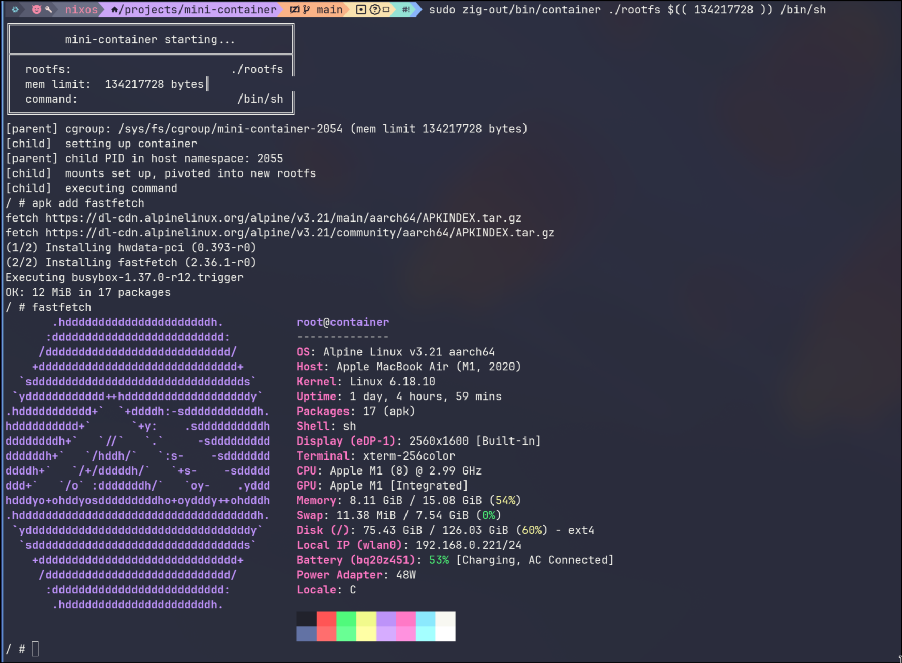
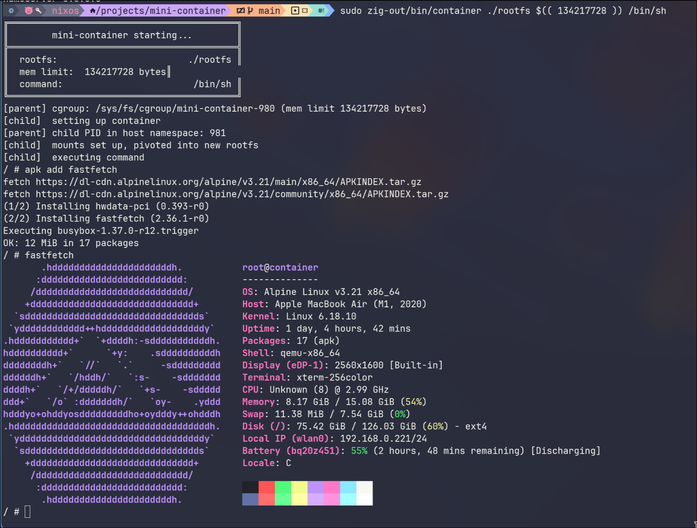

# Anatomy of a Naive Linux Container Runtime

- [Anatomy of a Naive Linux Container Runtime](#anatomy-of-a-naive-linux-container-runtime)
  - [Introduction](#introduction)
    - [how?](#how)
    - [why zig?](#why-zig)
  - [pivot\_root vs chroot](#pivot_root-vs-chroot)
  - [container runtime sequence](#container-runtime-sequence)
  - [rootfs](#rootfs)
    - [Download Alpine minirootfs](#download-alpine-minirootfs)
  - [Build \& Run](#build--run)
  - [TEST cgroups limits](#test-cgroups-limits)
  - [TODO](#todo)
    - [rootless (WIP)](#rootless-wip)
  - [Sources](#sources)


## Introduction

### how?

Recent lab exercises @hogent triggered my curiosity.  I know containers run isolated, but differenty than by virtualizing hardware.  They share resources with the host and are more lightweight than virtual machines.  The filesystem of a container is layered with overlayfs, at least for Docker (OverlayFS / overlayfs2).  That's pretty much it.  Pretty vague.

After looking around a bit, I came to understand that it's a matter of a handful of kernel features: cgroups, namespaces, unshare, pivot_chroot, ...

- cgroups ([linux control groups](https://man7.org/linux/man-pages/man7/cgroups.7.html)): handling resources and limits
- namespaces ([linux namespaces](https://man7.org/linux/man-pages/man7/namespaces.7.html)) with CLONE flags: this manage the isolation
- pivot_root ([change the root filesystem](https://man7.org/linux/man-pages/man8/pivot_root.8.html)): swap container's root filesystem
- unshare ([run program in new namespaces](https://man7.org/linux/man-pages/man1/unshare.1.html))

_the gist of it_ (with only new pid and /proc remount, no separate rootfs)

```bash
$ nix-shell -p util-linux --run "sudo unshare --fork --pid --mount-proc bash"
warning: $HOME ('/home/jeroen') is not owned by you, falling back to the one defined in the 'passwd' file ('/root')
warning: Nix search path entry '/nix/var/nix/profiles/per-user/root/channels' does not exist, ignoring

[root@nixos:/home/jeroen/projects/mini-container]# ps aux
USER         PID %CPU %MEM    VSZ   RSS TTY      STAT START   TIME COMMAND
root           1  0.0  0.0   9328  5600 pts/10   S    20:13   0:00 bash
root           5  0.0  0.0  10496  3984 pts/10   R+   20:16   0:00 ps aux

[root@nixos:/home/jeroen/projects/mini-container]#
```

In the process, I also discovered Talos for Kubernetes.  That's for another time.

### why zig?

I discovered zig at v0.11.  Early stages, immature, but functional and very promising.  Fairly easy to get started.  Actually, I started a refresh-project of the cool xymon monitoring tool.  After a few months however, I abandonned it because of breaking changes, moving target.
Now, we're at v0.15.2 and nearing the first production release.  So I wanted to give it another go.  I'm using claude.ai to give me a hand with picking it back up and even though it struggles with zig because of its small user base and available zig projects, it's better than a few years ago.


## pivot_root vs chroot
`chroot` only changes the process's path resolution root. The kernel just says "when this process resolves /, start from this directory instead." But the process's actual mount namespace is untouched -- the old root filesystem is still fully mounted and accessible. A privileged process can escape by using `fchdir` on a file descriptor opened before the chroot, or by creating a new mount namespace, or even by doing a second chroot with relative paths. It was never designed as a security boundary -- it was designed for system recovery and building packages.  And this is what we use when we install linux too.

`pivot_root` actually changes which mount is at the root of the mount namespace. It swaps the current root mount with a new one and moves the old root to a specified mountpoint. After that, you can (and should) unmount the old root entirely. Once it's unmounted, there's nothing to escape back to -- the old filesystem is simply gone from the namespace. This is why container runtimes use it.

`chroot` is cosmetic where `pivot_root` is structural

## container runtime sequence

The typical sequence a container runtime follows looks roughly like this:

1. Set up the overlayfs (stack the image layers, add writable upper layer)
2. clone() with the desired CLONE_NEW* flags to create an isolated child process
3. In the child: set up cgroup limits (or the parent does this before exec)
4. Mount /proc, /sys, /dev inside the new rootfs
5. pivot_root to the new rootfs, unmount the old root
6. Drop capabilities, set seccomp filters for syscall filtering
7. exec the container's entrypoint


## rootfs

### Download Alpine minirootfs

We want a separate and new filesystem, isolated from the host filesystem.  Alpine is know for its minimal size.

```bash
curl -fSL -o alpine-minirootfs.tar.gz \
  https://dl-cdn.alpinelinux.org/alpine/v3.21/releases/aarch64/alpine-minirootfs-3.21.3-aarch64.tar.gz

mkdir -p rootfs
sudo tar -xzf alpine-minirootfs.tar.gz -C rootfs
echo "nameserver 8.8.8.8" | sudo tee rootfs/etc/resolv.conf
```

for x86_64
My NixOS has binfmt_misc configured with QEMU user-mode emulation. When the kernel sees an x86_64 ELF binary, it transparently invokes qemu-x86_64 to translate the instructions at runtime.

```bash
curl -fSL -o alpine-minirootfs.tar.gz \
  https://dl-cdn.alpinelinux.org/alpine/v3.21/releases/x86_64/alpine-minirootfs-3.21.3-x86_64.tar.gz

mkdir -p rootfs
sudo tar -xzf alpine-minirootfs.tar.gz -C rootfs

# set up DNS inside the container
echo "nameserver 8.8.8.8" | sudo tee rootfs/etc/resolv.conf
```

## Build & Run

build

```bash
$ zig build -Doptimize=ReleaseSmall --summary all

Build Summary: 3/3 steps succeeded
install success
└─ install container success
   └─ compile exe container ReleaseSmall native success 417ms MaxRSS:129M

```


run

```bash
$ sudo zig-out/bin/container ./rootfs 134217728 /bin/sh
```

aarch64 / arm64

 

x86_64

 


## TEST cgroups limits

Run the container with 128MiB and write 50MiB blocks to tmpfs (in-memory).  We expect it to OOM at the 3rd block.


```bash
$ sudo zig-out/bin/container ./rootfs 134217728 /bin/sh
╔══════════════════════════════════════════╗
║        mini-container starting...        ║
╠══════════════════════════════════════════╣
║  rootfs:                        ./rootfs ║
║  mem limit:  134217728 bytes║
║  command:                        /bin/sh ║
╚══════════════════════════════════════════╝
[parent] cgroup: /sys/fs/cgroup/mini-container-184769 (mem limit 134217728 bytes)
[child]  setting up container
[parent] child PID in host namespace: 184770
[child]  mounts set up, pivoted into new rootfs
[child]  executing command
/ # while true; do cat /sys/fs/cgroup/memory.current; head -c 52428800 /dev/zero | cat >> /tmp/balloon; sleep 0.2; done
75874304
95780864
Killed
100433920
Killed
133398528
[parent] child terminated abnormally
```

```bash
$ dmesg | tail -n 2
[38505.055786] oom-kill:constraint=CONSTRAINT_MEMCG,nodemask=(null),cpuset=mini-container-184255,mems_allowed=0,oom_memcg=/mini-container-184255,task_memcg=/mini-container-184255,task=sh,pid=184256,uid=0
[38505.055794] Memory cgroup out of memory: Killed process 184256 (sh) total-vm:155376kB, anon-rss:3504kB, file-rss:3216kB, shmem-rss:0kB, UID:0 pgtables:112kB oom_score_adj:0
$
```


## TODO

- [ ] overlay2
- [ ] rootless
- [ ] ...


### rootless (WIP)

Almost everything the container does requires root (CAP_SYS_ADMIN):

- clone() with CLONE_NEWPID, CLONE_NEWNS, CLONE_NEWNET, CLONE_NEWIPC -- all need root
- mount(), pivot_root() -- need root
- mknod() for /dev/null etc. -- needs root
- Writing to /sys/fs/cgroup -- needs root

The escape hatch is CLONE_NEWUSER. This is how rootless Podman and rootless Docker work. A user namespace lets an unprivileged UID become UID 0 inside the container. Once it's "root" inside a user namespace, the kernel grants it capabilities for the other namespace operations (mount, pivot_root, etc.) -- but only within that namespace. It can't actually touch host resources.

We need to add:

1. Add CLONE_NEWUSER to the clone flags
After clone, write uid/gid mappings from the parent:

/proc/<child_pid>/uid_map  ->  "0 1000 1"   (container root = host uid 1000)
/proc/<child_pid>/gid_map  ->  "0 1000 1"

2. Write "deny" to /proc/<child_pid>/setgroups first (kernel requirement)

The tricky part is synchronization -- the child has to wait until the parent has written the mappings before it calls mount() or pivot_root(). We'd typically use a pipe: child blocks on read(), parent writes the mappings then closes the pipe, child proceeds.

To be continued ...

## Sources

- [Talos - The Kubernetes Operating System](https://www.talos.dev/)
- [Portainer on Talos with Kubernetes](https://docs.portainer.io/admin/environments/add/kube-create/omni)
- [The State of Immutable Linux](https://youtu.be/jvdPuTcdGXs?si=dDtiQstHnhKKlgYq)
- [Kubernetes Components - An Overview](https://kubernetes.io/docs/concepts/overview/components/)
- [OrbStack vs Apple Containers vs Docker on macOS: How They Really Differ Under the Hood](https://dev.to/tuliopc23/orbstack-vs-apple-containers-vs-docker-on-macos-how-they-really-differ-under-the-hood-53fj)
- [Ene cursus over Operating Systems](https://hogenttin.github.io/operating-systems/npe/)
- [What even is a container: namespaces and cgroups](https://jvns.ca/blog/2016/10/10/what-even-is-a-container/)
- [A Forking Server](<https://www2.lawrence.edu/fast/GREGGJ/CMSC480/process/forking.html#:~:text=Calling%20fork()%20in%20a,is%20called%20the%20child%20process.>)
- [Fork](https://man7.org/linux/man-pages/man2/fork.2.html)
- [Build a Container from Scratch in Go (Modern Namespaces + cgroup v2)](https://dev.to/faizanfirdousi/build-a-container-from-scratch-in-go-modern-namespaces-cgroup-v2-5556)
- [unshare](https://man7.org/linux/man-pages/man1/unshare.1.html)
- [bubblewrap](https://github.com/containers/bubblewrap)